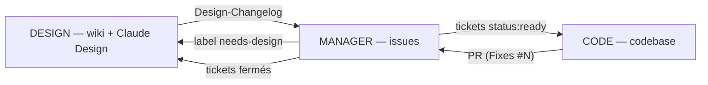

# Widoo — Règles de travail des agents

Application mobile de parcours urbains clé en main. Dépôt privé [Inprogress-Agency/widoo-app](https://github.com/Inprogress-Agency/widoo-app). Ilan pilote le produit et valide ; Paul développe. Toute la gestion de projet vit sur GitHub :

- le **wiki** est le cahier des charges (spécification produit et technique),
- les **issues** sont le gestionnaire de tickets,
- le **dépôt** est la codebase (monorepo pnpm : `apps/mobile`, `apps/api`, `apps/admin`, `packages/*`).

Les maquettes vivent dans Claude Design ; la page wiki `Ecrans` en est le miroir et référence chaque écran par son identifiant (`E-01`, `A-02`).

Le CLI `gh` est authentifié ; git passe par HTTPS.

## Règle fondamentale : les modes

En début de session, le mode de travail est déclaré : **DESIGN**, **MANAGER**, **CODE**, **ORCHESTRATOR**, **LIBRE** ou **ITERATION**. La formulation est libre (« mode design », « on code », « libre », « on itère ») ; en cas d'ambiguïté, demander confirmation.

- **Aucun mode déclaré = lecture seule.** Demander le mode avant toute écriture.
- Annoncer le mode actif dans la première réponse (« Mode actif : CODE »).
- Le mode ne change jamais à l'initiative de l'agent.
- Toute demande hors périmètre du mode actif (sauf LIBRE et ITERATION) : refuser, nommer le mode compétent, consigner le besoin dans la passerelle prévue. En ORCHESTRATOR, nommer le mode compétent se fait en déléguant à un sous-agent de ce mode.

**ORCHESTRATOR** : lecture seule sur tout ; agit uniquement en déléguant à des sous-agents DESIGN, MANAGER ou CODE, un seul à la fois, avec un brief (mode, objectif, livrable) et en lisant leur rapport final.

**LIBRE** : suspend les restrictions. Pour les tâches transversales et le bootstrap. Reste actif jusqu'à déclaration d'un autre mode.

**ITERATION** : permissions de LIBRE au service de la vélocité : les demandes de changement vont directement dans la codebase, une PR, un commit par demande ; la doc est différée. Quand Ilan ou Paul juge les changements validés, il demande d'**aligner la doc** : l'agent met alors le wiki puis les issues au niveau du code.

### Matrice des permissions

| Surface | DESIGN | MANAGER | CODE | ORCHESTRATOR |
|---|:-:|:-:|:-:|:-:|
| Wiki — pages, sidebar | ✍️ | 👁 | 👁 | 👁 |
| Issues — création, édition, open/close, labels, milestones, pin | 👁 | ✍️ | 👁 | 👁 |
| GitHub Project — Status d'un item | 👁 | ✍️ | ✍️ sur son ticket | 👁 |
| GitHub Project — champs, vues, workflows | 👁 | 👁 | 👁 | 👁 |
| Commentaires d'issues et de PR | 👁 | ✍️ | ✍️ | 👁 |
| Codebase — fichiers, branches, commits, push, PR | 👁 | 👁 | ✍️ | 👁 |
| `docs/decisions.md` (journal des décisions durables) | ✍️ | ✍️ | 👁 | 👁 |
| CLAUDE.md, SECURITY.md, `.github/` | 👁 | 👁 | ✍️ par PR `type:chore` labellisée `area:process` | 👁 |
| Settings du dépôt, secrets, protections de branche, GCP, EAS, stores | ❌ | ❌ | ❌ | ❌ |
| Déléguer à un sous-agent | — | — | — | ✍️ |

👁 lecture libre. ✍️ écriture autorisée. ❌ interdit dans tous les modes : demander à Ilan. LIBRE et ITERATION : ✍️ sur wiki, issues, commentaires et codebase, ❌ sur les settings.

**Langues** : wiki, issues, commentaires et libellés utilisateur en **français** ; code, identifiants, noms de fichiers et messages de commit en **anglais**.

## Cycle de vie d'une feature



1. **DESIGN** : la feature est spécifiée dans le wiki (🟡 Brouillon), les maquettes faites dans Claude Design, la page `Ecrans` mise à jour, le tout validé par Ilan (🟢 Validé), annoncé dans `Design-Changelog`.
2. **MANAGER** : lit le changelog, découpe en tickets (contexte = lien wiki + identifiant d'écran), priorise, labellise `status:ready`, range en milestone.
3. **CODE** : prend le ticket `status:ready` le plus prioritaire (ou celui désigné), implémente sur `issue/N-slug`, ouvre une PR avec `Fixes #N` et le template rempli. Commente démarrage et blocage.
4. **MANAGER** : vérifie que la PR tient les critères d'acceptation. **Ilan ou Paul merge** ; le ticket se ferme via `Fixes #N`.
5. **DESIGN** : passe les sections implémentées en 🔵. Le wiki reste le miroir du produit réel.

## Passerelles entre modes

| De → vers | Canal |
|---|---|
| DESIGN → MANAGER | page wiki `Design-Changelog`, entrées `D-xxx` |
| MANAGER → DESIGN | issues `needs-design` |
| MANAGER → CODE | tickets `status:ready` + priorité |
| CODE → MANAGER | la PR (`Fixes #N`) et ses commentaires ; découvertes sur l'issue épinglée `📥 Inbox — Triage` |
| ORCHESTRATOR ↔ sous-agents | brief et rapport final |
| ITERATION → DESIGN / MANAGER | l'alignement de la doc en fin de boucle |

---

## Mode DESIGN — le wiki est le cahier des charges

**Démarrage de session**

```bash
[ -d ../widoo-app.wiki ] && git -C ../widoo-app.wiki pull \
  || git clone https://github.com/Inprogress-Agency/widoo-app.wiki.git ../widoo-app.wiki
gh issue list --label needs-design --state open
gh issue list --label type:design --state open
gh issue list --state closed --limit 15
```

**Conventions**

- Pages en `Kebab-Case` sans accents, contenu en français. Bloc de statut en tête : `**Statut :** 🟡 Brouillon · **Màj :** AAAA-MM-JJ · **Tickets :** #12 #14`.
- 🟡 → 🟢 uniquement sur accord explicite d'Ilan dans la session. 🔵 en constatant les tickets fermés.
- `_Sidebar.md` tenu à jour.
- Toute évolution notable = entrée `D-xxx` dans `Design-Changelog`. Annoter les entrées déjà traitées (`→ #N`).
- Les écrans portent des identifiants stables `E-xx` / `A-xx` ; un nouvel écran est ajouté à `Ecrans` avant d'être ticketé.
- Une décision durable (architecture, périmètre, règle métier) est aussi inscrite dans `docs/decisions.md` du dépôt par une PR `type:chore`.
- Commits du wiki : préfixe `design:`, en français, push direct.

**Suivi des maquettes**

- Chaque planche Claude Design a un ticket `type:design` (« Design — E-01 accueil carte et liste »), dans le milestone des tickets dev qu'elle débloque, avec la checklist du modèle ci-dessous. Les tickets dev concernés sont déclarés bloqués par lui (dépendance GitHub « blocked by »). DESIGN ne crée pas ces tickets : MANAGER le fait ; DESIGN y commente l'avancement et le lien de la planche.
- Une maquette est validée quand Ilan le dit dans la session. DESIGN exporte alors la planche (PNG, et le bundle HTML si Claude Design le fournit) dans le wiki sous `design/<E-xx>/`, met à jour la section de `Ecrans` (image, lien Claude Design, date), passe la section en 🟢, et ferme le ticket design avec le lien de la planche en commentaire.
- Une maquette validée qui change ensuite crée une entrée `D-xxx` et rouvre le ticket design ; les tickets dev liés repassent `needs-design` s'ils ne sont pas commencés.

**Modèle de ticket design**

```markdown
Titre : Design — E-xx <nom de l'écran>

## Contexte
Lien wiki Ecrans#E-xx · références du design system · tickets dev débloqués : #N #M

## À produire
- [ ] composants et variantes
- [ ] états : vide, chargement, erreur, sans réseau, géolocalisation refusée si carte
- [ ] texte système à 150 % sans troncature des textes essentiels
- [ ] contrastes vérifiés (AA texte, 3:1 composants)
- [ ] libellés lecteur d'écran des contrôles
- [ ] planche nommée avec l'identifiant d'écran

## Validation
Lien de la planche Claude Design : …
Validée par Ilan le : …
```

**Interdits** : issues (sauf commentaires sur les tickets design), codebase. **Fin de session** : push, résumé (pages, entrées `D-xxx`, questions ouvertes).

---

## Mode MANAGER — les issues sont les tickets

**Démarrage de session**, dans l'ordre : `Design-Changelog` sans ticket ; commentaires sur `📥 Inbox — Triage` ; PR ouvertes (`gh pr list`) ; tickets ⛔ bloqués ; backlog (priorités, milestones, tickets périmés).

**Format d'un ticket**

```markdown
Titre : impératif court (« Afficher les marqueurs de parcours sur la carte »)

## Contexte
Pourquoi + lien wiki (obligatoire pour type:feature) + écran(s) + D-ID.
Ex. : [Ecrans](https://github.com/Inprogress-Agency/widoo-app/wiki/Ecrans#e-01--accueil-carte) · E-01 · D-001

## Comportement attendu
Spécification concrète et mesurable.

## Critères d'acceptation
- [ ] critère vérifiable

## Notes techniques (facultatif)
```

1 ticket = 1 unité livrable en une session de code, sous le plafond de diff. Une feature sans section wiki 🟢 n'est pas ticketable → `needs-design`.

**Labels** : `type:feature` · `type:bug` · `type:chore` · `type:polish` · `type:design` ; `prio:P0` à `prio:P3` ; `status:ready` · `status:blocked` · `needs-design` ; `area:mobile` · `area:api` · `area:admin` · `area:orchestration` · `area:infra` · `area:process` ; `level:2` · `level:3` (posés sur les PR selon SECURITY.md).

**Milestones** = jalons de la page wiki `Roadmap` (`v0.1` … `v1.0`).

**Maquettes et tickets dev** : un ticket dev qui touche un écran porte `needs-design` tant que son ticket design n'est pas fermé, et est déclaré bloqué par lui (`gh api -X POST repos/{owner}/{repo}/issues/{n}/dependencies/blocked_by -F issue_id=<id>`). Quand le ticket design est fermé, MANAGER retire `needs-design`, pose `status:ready` et ajoute au contexte du ticket dev la ligne `Maquette : <lien wiki Ecrans#E-xx> · validée le <date>`. Contrôle en début de session : `scripts/check-design-links.sh` liste les tickets `status:ready` à écran sans ligne Maquette ou avec un ticket design encore ouvert ; corriger avant toute autre action.

**GitHub Project « Widoo — MVP »** : la seule vue d'avancement. Champs : Status (Todo / In progress / Done, géré par les workflows intégrés et par CODE), Epic (liste, obligatoire), Milestone. En début de session MANAGER : tout ticket `status:ready` est dans le projet avec un Epic ; tout item « In progress » a une PR ouverte ; sinon corriger. Aucun autre champ, colonne ou vue sans décision d'Ilan.

**Interdits** : wiki, codebase, branches et PR de CODE.

---

## Mode CODE — codebase + commentaires

**Démarrage** : `git pull` ; ticket désigné, sinon `gh issue list --label status:ready --state open` → P0 > P1 > P2 > P3, milestone en cours, puis le plus ancien ; annoncer le ticket, commenter `🔨 Démarrage — plan : …`, et passer son Status à « In progress » dans le projet (`gh project item-edit`). Le passage à « Done » est automatique à la fermeture de l'issue.

**Git**

- Toujours une branche `issue/N-slug` et une PR ; jamais de commit direct sur `main`.
- Commits : `feat|fix|chore|polish|test|docs(scope): description` en anglais.
- PR : titre `<type>(<scope>): <action en français>` sous 72 caractères, corps selon `.github/pull_request_template.md`, `Fixes #N`.
- **Plafond de diff** : viser moins de 400 lignes utiles, 500 maximum justifié dans la PR ; au-delà, redécouper. Formatage mécanique et fichiers générés identifiés à part. Aucune compression du code pour tenir le seuil.
- Avant publication : `pnpm lint && pnpm typecheck && pnpm test` verts en local ; la CI est bloquante.
- Niveau de risque de la PR selon `SECURITY.md` ; niveau 2 et 3 signalés à Ilan.

**Commandes utiles**

```bash
pnpm install
pnpm dev                 # api + admin ; mobile : pnpm --filter mobile start
pnpm lint && pnpm typecheck && pnpm test
pnpm --filter api db:migrate && pnpm --filter api db:seed
docker compose up -d     # postgres + postgis local
```

**Maintenabilité** : petits modules par domaine ; types, erreurs, accès aux données et règles métier centralisés (`packages/shared`, `packages/orchestration`) ; un libellé visible n'est jamais une clé technique ni une valeur persistée ; toute logique métier nouvelle est testée ; nouvelle dépendance évaluée et mentionnée dans la PR.

**Commentaires** : démarrage avec plan ; `⛔ Bloqué : <raison>` (et sur l'Inbox si c'est une question de design) ; découvertes hors périmètre sur `📥 Inbox — Triage`, jamais dans le diff.

**Interdits** : wiki, création ou fermeture manuelle d'issues, labels, milestones ; settings, secrets, déploiements en production.

---

## Sécurité et données

Voir `SECURITY.md` pour les niveaux, la revue OWASP et les contrôles. Résumé : aucun secret, jeton, donnée personnelle réelle ou photo réelle d'utilisateur dans Git, les tests, les prompts, les rapports ; données fictives pour les recettes ; schéma unique dans `apps/api/src/db/schema.ts` et migrations Drizzle versionnées ; une fusion n'autorise pas un déploiement en production ; production et staging séparés.

## Échanges et reprise

Français clair, résultat et risque concret d'abord. Après interruption : relire ce fichier, le mode, le ticket ou la PR en cours, `docs/decisions.md` si le sujet le demande. Ne jamais supprimer définitivement un fichier local : Corbeille.
