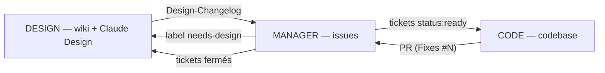

# Widoo — Règles de travail des agents

Application mobile de parcours urbains clé en main. Dépôt [Inprogress-Agency/widoo-app](https://github.com/Inprogress-Agency/widoo-app). Ilan pilote le produit et valide ; Paul développe. Toute la gestion de projet vit sur GitHub :

- le **wiki** est le cahier des charges (spécification produit et technique),
- les **issues** sont le gestionnaire de tickets,
- le **dépôt** est la codebase (monorepo pnpm : `apps/mobile`, `apps/api`, `apps/admin`, `packages/*`).

Les maquettes vivent dans Claude Design ; la page wiki `Ecrans` en est le miroir et référence chaque écran par son identifiant (`E-01`, `A-02`).

Le CLI `gh` est authentifié ; git passe par HTTPS.

## Règle fondamentale : les modes

En début de session, le mode de travail est déclaré : **INITIALISATION**, **DESIGN**, **MANAGER**, **CODE**, **ORCHESTRATOR**, **LIBRE** ou **ITERATION**. La formulation est libre (« mode design », « on code », « libre », « on itère ») ; en cas d'ambiguïté, demander confirmation.

Déclarer un mode charge le skill du plugin [gh-harness](https://github.com/PaulThiberville/gh-harness), **qui fait autorité sur la procédure** : démarrage de session, conventions, format des tickets, git, interdits, fin de session. Ce fichier ne porte que le contrat commun et ce qui est propre à Widoo. En cas de divergence entre les deux, le skill l'emporte sur la procédure, ce fichier l'emporte sur les faits du projet (labels, jalons, scripts, chemins), et la divergence se corrige au plus vite dans l'un ou dans l'autre.

- **Aucun mode déclaré = lecture seule.** Demander le mode avant toute écriture.
- Annoncer le mode actif dans la première réponse (« Mode actif : CODE »).
- Le mode ne change jamais à l'initiative de l'agent.
- Toute demande hors périmètre du mode actif (sauf LIBRE et ITERATION) : refuser, nommer le mode compétent, consigner le besoin dans la passerelle prévue. En ORCHESTRATOR, nommer le mode compétent se fait en déléguant à un sous-agent de ce mode.

**ORCHESTRATOR** : lecture seule sur tout ; agit uniquement en déléguant à des sous-agents DESIGN, MANAGER ou CODE, un seul à la fois, avec un brief (mode, objectif, livrable) et en lisant leur rapport final.

**LIBRE** : suspend les restrictions. Pour les tâches transversales et le bootstrap. Reste actif jusqu'à déclaration d'un autre mode.

**ITERATION** : permissions de LIBRE au service de la vélocité : les demandes de changement vont directement dans la codebase, une PR, un commit par demande ; la doc est différée. Quand Ilan ou Paul juge les changements validés, il demande d'**aligner la doc** : l'agent met alors le wiki puis les issues au niveau du code.

### Matrice des permissions

| Surface | INITIALISATION | DESIGN | MANAGER | CODE | ORCHESTRATOR |
|---|:-:|:-:|:-:|:-:|:-:|
| Wiki — pages, sidebar | 👁 (délègue) | ✍️ | 👁 | 👁 | 👁 |
| Issues — création, édition, open/close, labels, milestones, pin | 👁 (délègue) | 👁 | ✍️ | 👁 | 👁 |
| GitHub Project — Status d'un item | 👁 (délègue) | 👁 | ✍️ | ✍️ sur son ticket | 👁 |
| GitHub Project — champs, vues, workflows | 👁 | 👁 | 👁 | 👁 | 👁 |
| Commentaires d'issues et de PR | 👁 (délègue) | ✍️ tickets `type:design` | ✍️ | ✍️ | 👁 |
| Codebase — fichiers, branches, commits, push, PR | 👁 (délègue) | 👁 | 👁 | ✍️ | 👁 |
| CLAUDE.md, SECURITY.md, `.github/` | ✍️ | 👁 | 👁 | ✍️ par PR `type:chore` labellisée `area:process` | 👁 |
| Settings du dépôt, secrets, protections de branche, GCP, EAS, stores | ❌ | ❌ | ❌ | ❌ | ❌ |
| Déléguer à un sous-agent | ✍️ | — | — | — | ✍️ |

👁 lecture libre. ✍️ écriture autorisée. — hors process pour ce mode : demander à Ilan. ❌ interdit dans tous les modes : demander à Ilan. LIBRE et ITERATION : ✍️ sur wiki, issues, commentaires et codebase, ❌ sur les settings. INITIALISATION et ORCHESTRATOR n'écrivent pas eux-mêmes sur les surfaces du projet : tout passe par un sous-agent, sous les règles de son mode. Le bootstrap de Widoo est fait, INITIALISATION ne sert plus.

**Langues** : wiki, issues, commentaires et libellés utilisateur en **français** ; code, identifiants, noms de fichiers et messages de commit en **anglais**.

## Cycle de vie d'une feature



1. **DESIGN** : la feature est spécifiée dans le wiki (🟡 Brouillon), les maquettes faites dans Claude Design, la page `Ecrans` mise à jour, le tout validé par Ilan (🟢 Validé), annoncé dans `Design-Changelog`.
2. **MANAGER** : lit le changelog, découpe en tickets (contexte = lien wiki + identifiant d'écran), priorise, labellise `status:ready`, range en milestone.
3. **CODE** : prend le ticket `status:ready` le plus prioritaire (ou celui désigné), implémente sur `issue/N-slug`, ouvre une seule PR pour le ticket, avec `Fixes #N` et le template rempli. Commente démarrage et blocage.
4. **MANAGER** : vérifie que la PR tient les critères d'acceptation. **Ilan ou Paul fusionne en rebase and merge** ; le ticket se ferme via `Fixes #N`.
5. **DESIGN** : passe les sections implémentées en 🔵. Le wiki reste le miroir du produit réel.

## Passerelles entre modes

| De → vers | Canal |
|---|---|
| DESIGN → MANAGER | page wiki `Design-Changelog`, entrées `D-xxx` |
| MANAGER → DESIGN | issues `needs-design` |
| MANAGER → CODE | tickets `status:ready` + priorité |
| CODE → MANAGER | la PR (`Fixes #N`) et ses commentaires ; découvertes sur l'issue épinglée `📥 Inbox — Triage` |
| ORCHESTRATOR ↔ sous-agents | brief et rapport final |
| ITERATION → DESIGN / MANAGER | l'alignement de la doc en fin de boucle |

---

## Spécificités Widoo, par mode

Le reste de la procédure est dans le skill du mode.

**DESIGN** — le wiki est le cahier des charges.

- Les écrans portent des identifiants stables `E-xx` (mobile) et `A-xx` (admin) ; un nouvel écran est ajouté à la page `Ecrans` avant d'être ticketé. Les maquettes vivent dans Claude Design, `Ecrans` en est le miroir.
- Chaque planche a un ticket `type:design` créé par MANAGER. DESIGN y commente l'avancement, les questions ouvertes et le lien de la planche ; il ne le crée pas, ne le ferme pas et ne le labellise pas.
- Une planche validée par Ilan est exportée dans le wiki sous `design/<E-xx>/` (PNG, et le bundle HTML si Claude Design le fournit), la section de `Ecrans` reçoit l'image, le lien et la date, et passe en 🟢. La fermeture du ticket design et la libération des tickets dev reviennent à MANAGER, par `scripts/validate-design.sh`.
- Une planche validée qui change ensuite crée une entrée `D-xxx` et rouvre le ticket design ; les tickets dev liés repassent `needs-design` s'ils ne sont pas commencés.
- Ajouter au démarrage `gh issue list --label type:design --state open`.
- Une décision durable (architecture, périmètre, règle métier) s'écrit dans la page wiki qu'elle concerne, avec sa raison et ce qu'elle écarte, et s'annonce par une entrée `D-xxx` au `Design-Changelog`, seule série `D-xxx` du projet. Une décision de méthode va dans ce fichier, par une PR `area:process`.

**MANAGER** — les issues sont les tickets.

- Le contexte d'un ticket porte en plus le ou les écrans et le D-ID : `[Ecrans](https://github.com/Inprogress-Agency/widoo-app/wiki/Ecrans#e-01--accueil-carte) · E-01 · D-001`. Un ticket est livrable en une session de code et en une seule PR ; le plafond de diff porte sur chaque commit.
- **Labels** : `type:feature` · `type:bug` · `type:chore` · `type:polish` · `type:design` ; `prio:P0` à `prio:P3` ; `status:ready` · `status:blocked` · `needs-design` ; `area:mobile` · `area:api` · `area:admin` · `area:orchestration` · `area:infra` · `area:process` ; `level:2` · `level:3` (posés sur les PR par CODE, selon « Sécurité et données » ci-dessous).
- **Milestones** = jalons de la page wiki `Roadmap` (`v0.1` … `v1.0`).
- **Maquettes et tickets dev** : un ticket dev qui touche un écran porte `needs-design` tant que son ticket design n'est pas fermé, et est déclaré bloqué par lui (`gh api -X POST repos/{owner}/{repo}/issues/{n}/dependencies/blocked_by -F issue_id=<id>`). La validation d'une planche se fait par `scripts/validate-design.sh <n° ticket design> --date AAAA-MM-JJ --link <url Claude Design>` (`--dry-run` d'abord) : pousse le wiki, vérifie le 🟢 sous chaque écran dans `Ecrans`, ferme le ticket design avec le lien en commentaire et libère les tickets dev qu'il bloque (ligne `Maquette : <lien wiki> · validée le <date>`, `needs-design` → `status:ready`, Status Prêts sauf pour un ticket déjà parti en développement ; le ticket design passe Terminés), puis lance `scripts/sync-project.sh`.
- **Contrôles de début de session**, après la revue du skill : `scripts/check-design-links.sh` liste les tickets `status:ready` à écran sans ligne `Maquette :`, ceux encore bloqués par un ticket ouvert, et ceux restés `needs-design` alors que leur ticket design est fermé ; corriger avant toute autre action. Puis `scripts/sync-project.sh` aligne le Status du Project sur les labels, sans jamais faire reculer un ticket parti en développement : un item « En cours », « À review », « À déployer » ou « Terminés » garde son statut malgré `status:ready` ou `needs-design`, et le script le liste comme conservé. Il écrit aussi, sur chaque epic ouverte, le champ « Préparation » : l'état des tickets de sa liste cochable (prêts, en cours, attendent une maquette, à préparer, bloqués, faits).
- **Fermeture** : un ticket dev se ferme par le merge d'une PR `Fixes #N`, jamais à la main. Un ticket design se ferme par `scripts/validate-design.sh`.
- **GitHub Project « Widoo — MVP »** : la seule vue d'avancement. Champs : Status, Epic (liste, obligatoire), Milestone, Début et Fin (sur les epics, pour la Roadmap), Préparation (sur les epics, texte calculé par `scripts/sync-project.sh`, jamais saisi à la main). Statuts : **Cadrage** (à spécifier, maquetter ou découper ; hors Board), **Prêts** (= `status:ready`), **En cours** (CODE, à l'ouverture de la branche), **À review** (CODE, à l'ouverture de la PR), **À déployer** (workflow intégré, à la fermeture de l'issue par le merge), **Terminés** (après déploiement vérifié en staging, par Ilan ou Paul). Vues : Board (Prêts → Terminés), Roadmap (epics), Backlog (tout, groupé par Epic, avec la colonne Préparation). Vérifier que chaque ticket a un Epic et que tout item En cours ou À review a une branche ou une PR ouverte. Aucun autre champ, colonne ou vue sans décision d'Ilan.

**CODE** — la codebase et les commentaires.

- Au démarrage, passer le Status du ticket à « En cours », puis à « À review » à l'ouverture de la PR (`gh project item-edit`). « À déployer » est automatique au merge ; « Terminés » se pose après vérification en staging.
- Branche `issue/N-slug` et **une seule PR par ticket**, qui peut contenir plusieurs commits : un ticket ne se découpe pas en plusieurs PR ; une PR de process sans ticket à fermer utilise `chore/<sujet>` et `Refs #N`.
- Commits : `feat|fix|chore|polish|test|docs(scope): description` en anglais. La fusion se fait en rebase and merge, jamais en squash : chaque commit arrive tel quel sur `main`, donc chacun est autonome et cohérent, propre dès le départ. Les agents ne réécrivent pas l'historique d'une PR (le skill interdit le `push --force`, donc ni fixup ni rebase une fois poussé) : une correction passe par un commit correctif, qui reste dans l'historique. Le réglage du dépôt qui n'autorise que le rebase and merge sur `main` revient à Ilan ou Paul.
- PR : titre `<type>(<scope>): <action en français>` sous 72 caractères, corps selon `.github/pull_request_template.md`, `Fixes #N` (ou `Refs #N`).
- **Plafond de diff, par commit** : viser moins de 400 lignes utiles par commit, 500 maximum justifié dans la PR (ligne `Taille :`) ; au-delà, redécouper le commit, pas la PR. La PR affiche son total, sans plafond. Formatage mécanique et fichiers générés identifiés à part. Aucune compression du code pour tenir le seuil.
- **PR empilées** : seulement entre tickets dépendants, une PR par ticket. Après la fusion de la PR du bas, sur la branche suivante : `git fetch origin && git rebase origin/main` (git saute les commits déjà fusionnés à l'identique), puis `git push --force-with-lease` par Ilan ou Paul, et `gh pr edit <n> --base main`.
- Avant publication : `pnpm lint && pnpm typecheck && pnpm test` verts en local ; la CI est bloquante. Niveau de risque et revue OWASP selon « Sécurité et données » ci-dessous ; niveaux 2 et 3 signalés à Ilan.

```bash
pnpm install
pnpm dev                 # api + admin ; mobile : pnpm --filter mobile start
pnpm lint && pnpm typecheck && pnpm test
pnpm --filter api db:migrate && pnpm --filter api db:seed
docker compose up -d     # postgres + postgis local
```

- **Tokens de design** : `packages/tokens/generated/` ne s'édite jamais à la main ; `tokens.json` y est la copie du wiki (`design/design-system/tokens.json`). L'action `sync-tokens.yml` (toutes les heures, à la demande, et à chaque push du wiki qui édite une page) ouvre ou met à jour la PR « chore(tokens): synchroniser tokens.json vX depuis le wiki », thème régénéré. En CI, un écart avec le wiki n'est qu'un avertissement, sauf pour une PR qui touche le thème ou `tokens.json` : la synchroniser d'abord (`pnpm --filter @widoo/tokens sync`, puis `generate`).
- Une découverte hors périmètre va en commentaire sur `📥 Inbox — Triage`, jamais dans le diff : ni `TODO`, ni `FIXME`, ni code mort laissé en place.
- **Maintenabilité** : petits modules par domaine ; types, erreurs, accès aux données et règles métier centralisés (`packages/shared`, `packages/orchestration`) ; un libellé visible n'est jamais une clé technique ni une valeur persistée ; toute logique métier nouvelle est testée ; nouvelle dépendance évaluée et mentionnée dans la PR.
- **Accessibilité** : toute PR mobile qui touche un écran respecte les règles du wiki [Direction-Artistique › Accessibilité](https://github.com/Inprogress-Agency/widoo-app/wiki/Direction-Artistique#accessibilit%C3%A9--r%C3%A8gles-pour-le-code) : aucune hauteur fixe sur un composant qui contient du texte ; `maxFontSizeMultiplier={1.3}` sur les composants denses, posé dans les composants de base du design system (chips, barre d'onglets, étiquettes de marqueurs, compteur, pilule de tri, pastilles) ; deux reflows seulement à `fontScale >= 1.3` (tooltip réduite, résumé de parcours avec le bouton sous le titre) ; contrastes 4,5:1 texte et 3:1 composants (bleu encre `#3A4FA8` pour un lien sur gris chaud) ; `accessibilityLabel`, `accessibilityRole` et `accessibilityState` sur chaque contrôle, card en un seul élément avec `accessibilityActions` ; zones tactiles 44 px. Test à 150 % de texte système avant d'ouvrir la PR, mentionné dans sa description.

---

## Sécurité et données

Les exigences produit sont dans le wiki : [Securite-et-RGPD](https://github.com/Inprogress-Agency/widoo-app/wiki/Securite-et-RGPD) (actifs, propriétés obligatoires, données personnelles) et [Architecture-Technique › Environnements](https://github.com/Inprogress-Agency/widoo-app/wiki/Architecture-Technique#environnements). Cette section porte les consignes de travail qui en découlent : CODE les applique, MANAGER les lit pour suivre les labels `level:*`. `SECURITY.md` ne porte que la procédure de signalement d'une vulnérabilité, écrite pour un lecteur externe.

Résumé : aucun secret, jeton, donnée personnelle réelle ou photo réelle d'utilisateur dans Git, les tests, les prompts, les rapports ; données fictives pour les recettes ; schéma unique dans `apps/api/src/db/schema.ts` et migrations Drizzle versionnées ; une fusion n'autorise pas un déploiement en production ; production et staging séparés.

**Revue OWASP du diff** : référence OWASP Top 10, dans son édition en cours à la date de la PR (vérifier à chaque nouvelle édition). C'est une routine de développement, pas un audit. Elle se déclenche quand un diff modifie : accès, rôles ou appels sortants ; configuration, en-têtes, CORS ; dépendances, CI, livraison ; authentification, session, cryptographie ; SQL, rendu ou en-têtes issus d'entrées non fiables ; règle métier de sécurité (modération, signaux, quotas) ; intégrité de la base ou du stockage, migration, sauvegarde ; journalisation ; limites, reprise et opérations multi-étapes. Sortie attendue dans la section Risque de la PR, en quelques lignes : catégories pertinentes, contrôle concret, test ou raison de non-applicabilité. Un changement purement visuel, textuel ou de test ne la déclenche pas.

**Niveaux de risque** : chaque PR annonce son niveau sur la ligne `Niveau :` du modèle de PR, avec une justification en une ligne.

| Niveau                | Changement                                                                                                                                                                                                                                              | Contrôle requis                                                                            |
| --------------------- | ------------------------------------------------------------------------------------------------------------------------------------------------------------------------------------------------------------------------------------------------------- | ------------------------------------------------------------------------------------------ |
| 1 — courant           | Aucun effet matériel sur sécurité, données, infrastructure ou restauration                                                                                                                                                                              | Tests et CI                                                                                |
| 2 — sensible et borné | Effet réel, réversible et circonscrit : migration additive, nouvelle donnée persistée non destructive, configuration, quota, règle de modération, nouveau endpoint authentifié                                                                          | Revue OWASP ciblée, tests, retour arrière décrit, validation d'Ilan avant production       |
| 3 — critique          | Risque plausible de perte ou corruption de données, contournement d'accès ou de rôle, fuite de secret ou de données personnelles, migration destructive, changement d'architecture d'auth ou de stockage, nouveau sous-traitant de données personnelles | Staging et tests ; puis, sur le commit figé, revue indépendante proportionnée avant fusion |

Aux niveaux 2 et 3, CODE pose le label `level:2` ou `level:3` sur la PR et signale le niveau à Ilan. Au niveau 3, la fusion est suspendue jusqu'à ce qu'Ilan autorise la suite. Un risque résiduel qu'Ilan accepte se consigne dans le wiki, [Securite-et-RGPD › Risques acceptés](https://github.com/Inprogress-Agency/widoo-app/wiki/Securite-et-RGPD#risques-accept%C3%A9s) : contexte, raison, lien de la PR, date de révision (section tenue par DESIGN).

**Alertes de dépendance** : la règle, qui fixe le seuil à partir duquel une alerte bloque, est dans [Securite-et-RGPD › Propriétés obligatoires](https://github.com/Inprogress-Agency/widoo-app/wiki/Securite-et-RGPD#propri%C3%A9t%C3%A9s-obligatoires). Une alerte qui atteint ce seuil bloque la PR. Une alerte faible devient une dette suivie en issue : CODE ne crée pas l'issue, il signale l'alerte sur l'Inbox [#4](https://github.com/Inprogress-Agency/widoo-app/issues/4), et MANAGER ouvre l'issue.

**Production et actions distantes** : une fusion n'autorise pas un déploiement. Staging se déploie automatiquement depuis `main` ; la production se déploie à la main, par Ilan ou Paul, après un staging vert. Toute action distante (migration en production, changement de configuration, rotation de secret) annonce sa cible, son effet et son retour arrière avant exécution. Un rollback applicatif ne restaure pas une donnée supprimée.

## Échanges et reprise

Français clair, résultat et risque concret d'abord. Toute mention d'un ticket, d'une epic ou d'une PR dans une réponse porte son lien GitHub complet (`https://github.com/Inprogress-Agency/widoo-app/issues/N`), jamais un numéro seul. Après interruption : relire ce fichier, le mode, le ticket ou la PR en cours, la page wiki concernée si le sujet le demande. Ne jamais supprimer définitivement un fichier local : Corbeille.
